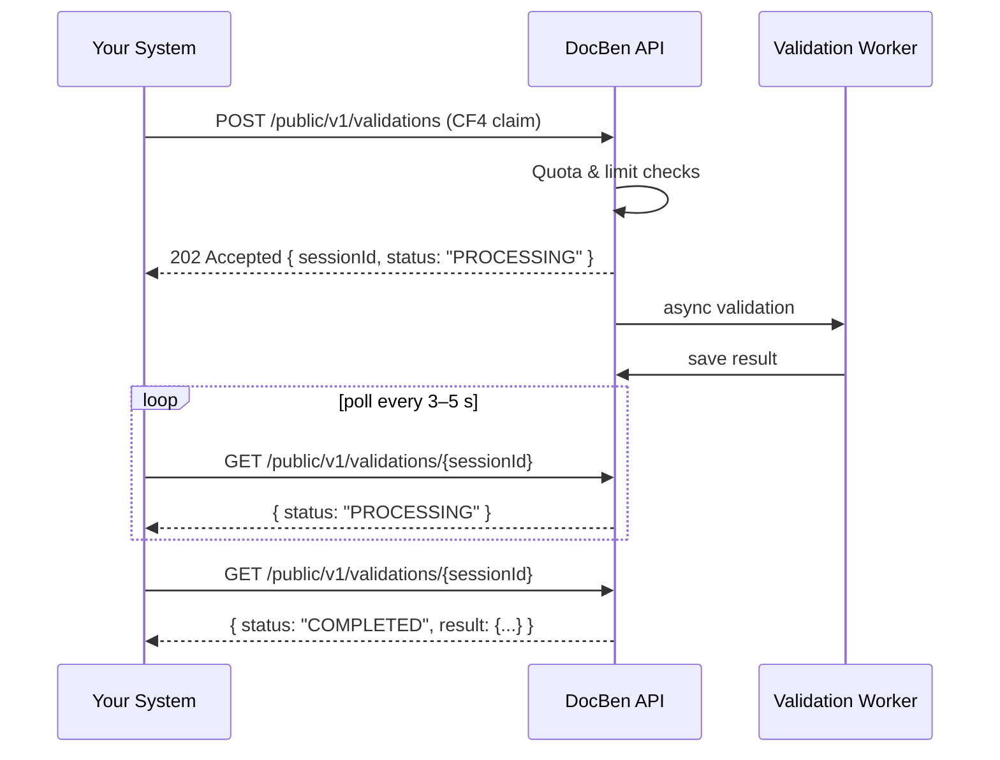

# DocBen CF4 Validation API — Client Integration Guide

Welcome! This guide shows you how to integrate your system with the **DocBen CF4 Validation API** so you can submit Philippine PhilHealth CF4 claims for AI-powered validation and retrieve the results programmatically.

> **Audience:** 3rd-party developers / integrators
> **Protocol:** HTTPS + JSON
> **Auth:** API key (`x-api-key` header)

---

## Table of Contents

1. [Overview](#overview)
2. [Getting Your API Key](#getting-your-api-key)
3. [Base URL & Authentication](#base-url-amp-authentication)
4. [Quotas, Rate Limits & Token Caps](#quotas-rate-limits-amp-token-caps)
5. [The Validation Lifecycle](#the-validation-lifecycle)
6. [Endpoint Reference](#endpoint-reference)
7. [Submitting as eClaims 3.0 XML](#submitting-as-eclaims-30-xml)
8. [Handling Attachments](#handling-attachments)
9. [Step-by-Step: Your First Validation](#step-by-step-your-first-validation)
10. [Sample Code — JavaScript (Node.js)](#sample-code--javascript-nodejs)
11. [Sample Code — TypeScript](#sample-code--typescript)
12. [curl Examples](#curl-examples)
13. [Bruno / Postman Collection](#bruno--postman-collection)
14. [OpenAPI Specification](#openapi-specification)
15. [Error Reference](#error-reference)
16. [Best Practices](#best-practices)
17. [FAQ](#faq)

---

## 1. Overview

The DocBen CF4 Validation API lets you submit a CF4 claim (patient info, history, physical exam, doctor's orders, medicines, etc.) plus optional supporting documents. Our AI pipeline validates the claim against PhilHealth rules and returns:

- a **quality percentage** (0–100),
- a list of **rejection reasons** (issues that would cause PhilHealth to deny the claim), and
- optional **DRG classification**.

**Two ways to submit a claim:**

1. **JSON (DocBen proprietary format)** — a structured JSON payload describing the claim (see [CF4 Payload Fields](#cf4-payload-fields)).
2. **XML (official PhilHealth eClaims 3.0)** — send the standard eClaims 3.0 XML document and the API translates it to the internal format before validating. See [Submitting as eClaims 3.0 XML](#submitting-as-eclaims-30-xml).

Validation is **asynchronous**: you submit a claim, receive a `sessionId`, then poll for the result. A typical validation completes in **10–60 seconds** depending on the number of attachments (longer when attachments require OCR/classification).

---

## 2. Getting Your API Key

API keys are issued by DocBen. Contact your DocBen account manager to request a key. You will receive:

- **An API key** (a long random string) — shown **only once**. Store it securely.
- Your **client ID** and the limits applied to your account (request quota, rate limit, token cap).

> ⚠️ **Keep your API key secret.** It identifies and meters your account. If it is ever exposed, contact DocBen immediately to rotate it. Do not embed it in client-side (browser/mobile) code or commit it to source control.

---

## 3. Base URL & Authentication

**Base URL:**

```
https://api.docbenai.com
```

All endpoints are relative to this base (for example, `POST https://api.docbenai.com/public/v1/validations`). Send your API key on **every request** in the `x-api-key` header:

```
x-api-key: YOUR_API_KEY_HERE
```

All request and response bodies are JSON unless noted. Always set `Content-Type: application/json` for POST/PUT requests with a JSON body.

---

## 4. Quotas, Rate Limits & Token Caps

Your account has three independent limits. Exceeding any of them returns an error:

| Limit | What it controls | Where enforced | Error when exceeded |
|---|---|---|---|
| **Rate limit** | Requests per second (with a small burst) | At the edge | `429` |
| **Monthly request quota** | Number of validation requests per calendar month | At the edge + in the API | `429` (`monthly_request_quota`) |
| **Monthly token cap** | Total AI tokens your account may consume per month (a cost-control measure) | In the API | `429` (`monthly_token_cap`) |

Counters reset on the **1st of each month (UTC)**. You can check your current usage at any time with the [`GET /public/v1/quota`](#get-publicv1quota) endpoint — we recommend calling it before submitting large batches.

> **Why a token cap in addition to a request quota?** A single request can consume a variable amount of AI compute (larger claims and more attachments cost more). The token cap prevents unexpectedly heavy claims from consuming your entire budget. See [Best Practices](#best-practices).

---

## 5. The Validation Lifecycle



**States:**

| `status` | Meaning |
|---|---|
| `PROCESSING` | Validation is underway. Keep polling. |
| `COMPLETED` | Validation finished. `result` is populated. |
| `FAILED` | Validation failed. See `error` for details. |

---

## 6. Endpoint Reference

All endpoints are under the `/public/v1` prefix.

| Method | Path | Purpose |
|---|---|---|
| `POST` | `/public/v1/validations` | Submit a CF4 claim for validation |
| `GET` | `/public/v1/validations/{sessionId}` | Poll validation status/result |
| `GET` | `/public/v1/quota` | Check your current usage & limits |
| `POST` | `/public/v1/uploads/init` | Begin a file (attachment) upload |
| `PUT` | `/public/v1/uploads/chunk` | Upload a file chunk |
| `POST` | `/public/v1/uploads/complete` | Finish a file upload |
| `POST` | `/public/v1/uploads/abort` | Abort a file upload |

---

### POST /public/v1/validations

Submit a CF4 claim for validation. You can submit in **either** of two formats:

- **JSON** (`Content-Type: application/json`) — the DocBen proprietary payload.
- **XML** (`Content-Type: application/xml`) — an official PhilHealth eClaims 3.0 document.

**JSON request body:**

```json
{
  "message": { "...CF4 claim fields...": "..." },
  "attachmentsMeta": [
    {
      "attachmentId": "a1b2c3d4-...",
      "s3Key": "your-client-id/your-client-id/1726...-a1b2c3d4.pdf",
      "fileName": "cbc-result.pdf",
      "size": 102400,
      "contentType": "application/pdf"
    }
  ]
}
```

| Field | Type | Required | Description |
|---|---|---|---|
| `message` | object | ✅ (JSON) | The CF4 claim payload (see [CF4 payload](#cf4-payload-fields)). |
| `attachmentsMeta` | array | ➖ | Metadata for attachments previously uploaded via `/uploads/*`. Omit for no attachments. |

**XML request body:** the raw eClaims 3.0 document as the request body, with header `Content-Type: application/xml`. Attachments are embedded in the XML as base64 `<DOCUMENT>` entries (see [Submitting as eClaims 3.0 XML](#submitting-as-eclaims-30-xml)).

**Success — `202 Accepted`:**

```json
{
  "message": "CF4 validation started.",
  "sessionId": "9f2c1a7e-3d4b-4e8f-9a01-1c2d3e4f5a6b",
  "validationStatus": "PROCESSING",
  "validationRequestId": "c41f...",
  "storedAttachments": [ { "attachmentId": "...", "fileName": "cbc-result.pdf", "...": "..." } ]
}
```

Save the `sessionId` — you need it to poll for the result.

**Failure responses:** see [Error Reference](#error-reference).

---

### GET /public/v1/validations/{sessionId}

Poll the status and result of a validation. You may only poll sessions that belong to your account.

**Success — `200 OK` (while running):**

```json
{
  "sessionId": "9f2c1a7e-...",
  "status": "PROCESSING",
  "claimStatus": "Validation In Progress",
  "requestedAt": "2026-09-19T08:15:00.000Z",
  "completedAt": null,
  "result": null,
  "attachments": []
}
```

**Success — `200 OK` (completed):**

```json
{
  "sessionId": "9f2c1a7e-...",
  "status": "COMPLETED",
  "claimStatus": "Flagged",
  "requestedAt": "2026-09-19T08:15:00.000Z",
  "completedAt": "2026-09-19T08:15:38.000Z",
  "result": {
    "qualityPercentage": 72,
    "rejectionReason": [
      { "fieldName": "attachments", "reason": "Missing required laboratory result (CBC)." },
      { "fieldName": "doctorsOrders", "reason": "No doctor's order entry for 01/18/2025." }
    ],
    "drgClassification": "04523",
    "drgClassificationDesc": "Respiratory infection/inflammation, w severe CC",
    "drgSystem": "TDRGv5"
  },
  "attachments": [
    {
      "attachmentId": "a1b2c3d4-...",
      "fileName": "cbc-result.pdf",
      "size": 102400,
      "contentType": "application/pdf",
      "classification": {
        "documentType": "Laboratory Result",
        "philhealthAttachment": "Laboratory",
        "confidence": 0.98
      }
    }
  ]
}
```

**Result fields:**

| Field | Type | Description |
|---|---|---|
| `result.qualityPercentage` | number | 0–100 quality score. |
| `result.rejectionReason` | array | Issues found. Empty array = no issues. Each item has `fieldName` and `reason`. |
| `result.drgClassification` | string/null | The PhilHealth DRG code (Thai DRG v5), e.g. `04523`. See [How DRG is assigned](#how-drg-is-assigned). |
| `result.drgClassificationDesc` | string/null | The official PhilHealth description of `drgClassification`, from the DRG grouper's own code table. Always matches the code. |
| `result.drgSystem` | string/null | `TDRGv5` when a DRG was assigned, else `null`. |
| `claimStatus` | string | `Flagged` (issues found) or `No Issues Detected`. |

### How DRG is assigned

The DRG is computed by a **deterministic PhilHealth DRG grouper** (Thai DRG v5), not by the LLM — so the same claim always yields the same code. The grouper follows the official algorithm: it derives the **MDC** (Major Diagnostic Category) from the primary diagnosis, refines to a **DC** (Disease Cluster) using the procedure codes and diagnoses, then stratifies by the **CC** (complication/comorbidity) severity level to produce the final 5-digit DRG.

- **XML submissions** carry structured ICD-10 and RVS/ICD-9 procedure codes, so the grouper runs directly on them (most accurate).
- **JSON submissions** are free-text; the API first extracts the primary/secondary diagnoses and procedures as codes, then groups them.
- `drgClassificationDesc` always comes from the grouper's official code table — it is never free-text generated.
- When a claim genuinely cannot be grouped, the grouper returns PhilHealth's sentinel codes: `26509` (Ungroupable), `26519` (Unacceptable PDx), `26539` (Ungroupable, invalid age), `26549` (LOS < 2 hours). When DRG cannot be determined at all (e.g., insufficient clinical data), all three DRG fields are `null`.

---

### GET /public/v1/quota

Returns your current monthly usage and limits.

**Success — `200 OK`:**

```json
{
  "clientId": "your-client-id",
  "status": "active",
  "monthlyRequestQuota": 1000,
  "requestsUsed": 42,
  "requestsRemaining": 958,
  "monthlyTokenCap": 500000,
  "tokensUsed": 120340,
  "tokensRemaining": 379660,
  "rateLimitRps": 2,
  "cycleStartDate": "2026-09-01",
  "resetsOn": "2026-10-01"
}
```

---

## 7. Submitting as eClaims 3.0 XML

Instead of the proprietary JSON payload, you can submit a claim as an **official PhilHealth eClaims 3.0 XML document**. The API parses the XML, translates it to the internal format, and runs the same validation pipeline. The response (status, quality, rejections, DRG) is identical to a JSON submission.

### How to submit XML

Send the raw XML as the request body with `Content-Type: application/xml`:

```bash
curl -X POST "https://api.docbenai.com/public/v1/validations" \
  -H "x-api-key: $KEY" \
  -H "Content-Type: application/xml" \
  --data-binary @claim.xml
```

```http
POST /public/v1/validations HTTP/1.1
x-api-key: YOUR_API_KEY_HERE
Content-Type: application/xml

<?xml version="1.0" encoding="UTF-8"?>
<!DOCTYPE ECLAIMS SYSTEM "eClaims3.0.dtd">
<ECLAIMS pUserName="" pPassword="" pHospitalCode="HCP-001" pSoftwareCertId="">
  <CLAIM pClaimNumber="CLM2026001" pTrackingNumber="TRK-001" pIsFinal="Y">
    <CF1 ... />
    <CF2 ...>...</CF2>
    <CF4 ...>...</CF4>
    <ESOA ...>...</ESOA>
  </CLAIM>
</ECLAIMS>
```

> The `pUserName`/`pPassword`/`pSoftwareCertId` attributes are left blank — they are PhilHealth-internal and **not** required (or used) by DocBen.

The response is the usual `202 Accepted` with a `sessionId` you poll as normal.

### What gets mapped (eClaims 3.0 → internal format)

| eClaims 3.0 element | How it's used |
|---|---|
| `CF1` (member & patient) | Patient = clinical subject; member recorded for billing context. Dependents (`pPatientType="D"`) handled. |
| `CF2` (admission, discharge, diagnoses, procedures, physicians) | Admit/discharge dates (ISO) & times (24h) split into internal parts; case-rate codes; diagnoses; procedures & physician fees stored. |
| `CF3` (maternity) | Obstetric data (gestation, delivery, gravida/para) stored. |
| `CF4` (clinical summary, vitals, medications) | Chief complaint, HPI, physical exam narrative, vital signs, medicines. |
| `ESOA` + `ITEMIZED_CHARGES` | Billing/charges stored (not validated in v1). |
| `ATTACHMENTS` / `DOCUMENT` | Base64 documents decoded and uploaded as attachments (see below). |

### Validation behavior specific to XML claims

> **🔒 You do NOT need to send your PhilHealth credentials.**
> The `pUserName` / `pPassword` / `pSoftwareCertId` attributes on the `<ECLAIMS>` root are **completely ignored** by this API. Authentication is handled solely by your DocBen **API key** (`x-api-key` header). Those attributes exist for PhilHealth's *internal* eClaims authentication — leave them blank (or placeholder) when submitting to DocBen. They are never validated and never sent to the model.

- **Symptoms are derived** from the chief complaint + HPI narrative (the DTD has no structured symptoms field). This is negation-aware — "no fever" / "denies chest pain" are not counted as that symptom.
- **Physical exam** free text is mapped to named sections where possible; if it can't be sectioned, the LLM judges the narrative directly (deterministic section checks are skipped).
- **`doctorsOrders` daily-coverage check does not apply** to XML claims (the DTD has no doctorsOrders field).
- **`pHospitalCode`** on the `<ECLAIMS>` root is only a soft sanity check, not authentication.

### Attachments in XML

Embed documents as base64 inside the XML:

```xml
<ATTACHMENTS>
  <DOCUMENT pDocType="LAB_RESULT"
            pFileName="CBC_Result.pdf"
            pMimeType="application/pdf"
            pBase64Data="JVBERi0xLjQKJeLjz9MKMyAwIG9iago..." />
</ATTACHMENTS>
```

- They are decoded, uploaded as attachments, and classified/validated like any other attachment.
- **Size limit:** the combined base64 payload is capped (~6 MB) because API Gateway caps requests at 10 MB. For larger files, use the [chunked-upload endpoints](#handling-attachments) instead and submit via JSON, or keep XML attachments small.
- `pDocType` values: `CSF`, `LAB_RESULT`, `OPERATIVE_TECH`, `OTHER`.

### XML validation errors

A malformed or non-eClaims document returns `400` with a specific reason so you can fix the payload:

```json
{
  "message": "Invalid eClaims document: CF1.pMemberPIN is required; CLAIM.ESOA is required",
  "code": "invalid_eclaims",
  "errors": ["CF1.pMemberPIN is required", "CLAIM.ESOA is required"]
}
```

Common codes: `malformed_xml`, `not_eclaims`, `invalid_eclaims`, `attachment_too_large`.

> **Note on the eClaims 3.0 DTD:** the XML feature follows the eClaims 3.0 schema (`ECLAIMS/CF1/CF2/CF3/CF4/ESOA/ATTACHMENTS`). Confirm the exact DTD version and attachment mechanism against PhilHealth's current certification documentation for your integration.

---

## 8. Handling Attachments

Supporting documents (lab results, X-rays, operative records, etc.) are validated alongside the claim. Because files can be large, **you upload them first**, then reference them in the validation request. Files never travel inside the `POST /validations` body.

The upload flow is a 3-step **multipart upload**:

1. **`POST /uploads/init`** — tell us the file name/size/type. We return an `uploadId`, `attachmentId`, and `s3Key`.
2. **`PUT /uploads/chunk`** — send the file in one or more base64-encoded chunks (parts).
3. **`POST /uploads/complete`** — finalize. We return a full `attachment` metadata object.

You then pass that metadata in `attachmentsMeta` when calling `POST /validations`.

> **Chunk size:** Use **5 MB per chunk** (`5 * 1024 * 1024` bytes) for reliability. Small files can be sent as a single chunk (`partNumber: 1`).

### POST /public/v1/uploads/init

```json
// Request
{ "fileName": "cbc-result.pdf", "size": 102400, "contentType": "application/pdf" }

// Response 200
{
  "attachmentId": "a1b2c3d4-e5f6-...",
  "uploadId": "abc123uploadid...",
  "s3Key": "your-client-id/your-client-id/1726660000000-a1b2c3d4.pdf",
  "fileName": "cbc-result.pdf",
  "contentType": "application/pdf"
}
```

### PUT /public/v1/uploads/chunk

Send one chunk. `chunkData` is the raw bytes **base64-encoded**. `partNumber` starts at 1.

```json
// Request
{
  "uploadId": "abc123uploadid...",
  "attachmentId": "a1b2c3d4-e5f6-...",
  "s3Key": "your-client-id/your-client-id/1726660000000-a1b2c3d4.pdf",
  "partNumber": 1,
  "chunkData": "JVBERi0xLjQKJeLjz9MKMyAwIG9iago..."
}

// Response 200
{ "attachmentId": "a1b2c3d4-e5f6-...", "partNumber": 1, "etag": "\"etagvalue\"" }
```

Keep each response's `etag` and `partNumber` — you need them to complete the upload.

### POST /public/v1/uploads/complete

```json
// Request
{
  "uploadId": "abc123uploadid...",
  "attachmentId": "a1b2c3d4-e5f6-...",
  "s3Key": "your-client-id/your-client-id/1726660000000-a1b2c3d4.pdf",
  "fileName": "cbc-result.pdf",
  "size": 102400,
  "contentType": "application/pdf",
  "parts": [ { "partNumber": 1, "etag": "\"etagvalue\"" } ]
}

// Response 200
{
  "attachment": {
    "attachmentId": "a1b2c3d4-e5f6-...",
    "fileName": "cbc-result.pdf",
    "size": 102400,
    "contentType": "application/pdf",
    "s3Key": "your-client-id/your-client-id/1726660000000-a1b2c3d4.pdf",
    "etag": "\"final-etag\"",
    "uploadedAt": "2026-09-19T08:10:00.000Z"
  }
}
```

Use the fields of this `attachment` object (`attachmentId`, `s3Key`, `fileName`, `size`, `contentType`) as an entry in `attachmentsMeta`.

### POST /public/v1/uploads/abort

If you need to cancel an in-progress upload:

```json
{ "uploadId": "abc123uploadid...", "s3Key": "your-client-id/..." }
```

---

## 9. Step-by-Step: Your First Validation

**Step 0 — (optional) Check your quota**

```
GET /public/v1/quota
```

Make sure `requestsRemaining > 0` and `tokensRemaining` is comfortably above ~10,000.

**Step 1 — (optional) Upload attachments**

For each file: `init` → one or more `chunk` → `complete`. Collect each returned `attachment` object. Skip this step if your claim has no attachments.

**Step 2 — Submit the claim**

```
POST /public/v1/validations
{ "message": { ...CF4 fields... }, "attachmentsMeta": [ ...attachment objects... ] }
```

Read `sessionId` from the `202` response.

**Step 3 — Poll for the result**

```
GET /public/v1/validations/{sessionId}
```

Poll every **3–5 seconds** until `status` is `COMPLETED` or `FAILED`. Stop after a reasonable timeout (e.g. 3 minutes).

**Step 4 — Read the result**

On `COMPLETED`, inspect `result.qualityPercentage` and `result.rejectionReason`. An empty `rejectionReason` array means the claim passed with no detected issues.

---

## 10. Sample Code — JavaScript (Node.js)

A complete, dependency-free client using Node 18+'s built-in `fetch`. Save as `docbenClient.js`.

```js
/**
 * DocBen CF4 Validation API — minimal JavaScript client (Node 18+).
 * No external dependencies.
 */

const fs = require('fs');
const path = require('path');

const BASE_URL = process.env.DOCBEN_BASE_URL || 'https://api.docbenai.com';
const API_KEY = process.env.DOCBEN_API_KEY; // set this env var — never hardcode your key
const CHUNK_SIZE = 5 * 1024 * 1024; // 5 MB

if (!API_KEY) {
  throw new Error('Set the DOCBEN_API_KEY environment variable.');
}

const headers = {
  'x-api-key': API_KEY,
  'Content-Type': 'application/json',
};

async function request(method, urlPath, body) {
  const res = await fetch(`${BASE_URL}${urlPath}`, {
    method,
    headers,
    body: body ? JSON.stringify(body) : undefined,
  });
  const text = await res.text();
  let data;
  try { data = text ? JSON.parse(text) : {}; } catch { data = { raw: text }; }
  if (!res.ok) {
    const err = new Error(data.message || `HTTP ${res.status}`);
    err.status = res.status;
    err.code = data.code;
    err.body = data;
    throw err;
  }
  return data;
}

// ── Quota ──────────────────────────────────────────────────────
async function getQuota() {
  return request('GET', '/public/v1/quota');
}

// ── Attachment upload (init -> chunk(s) -> complete) ──────────
async function uploadAttachment(filePath) {
  const fileName = path.basename(filePath);
  const buffer = fs.readFileSync(filePath);
  const size = buffer.length;
  const contentType = fileName.toLowerCase().endsWith('.pdf') ? 'application/pdf' : 'application/octet-stream';

  // 1. init
  const init = await request('POST', '/public/v1/uploads/init', { fileName, size, contentType });
  const { uploadId, attachmentId, s3Key } = init;

  // 2. chunks
  const parts = [];
  const totalParts = Math.max(1, Math.ceil(size / CHUNK_SIZE));
  for (let partNumber = 1; partNumber <= totalParts; partNumber += 1) {
    const start = (partNumber - 1) * CHUNK_SIZE;
    const chunk = buffer.subarray(start, start + CHUNK_SIZE);
    const resp = await request('PUT', '/public/v1/uploads/chunk', {
      uploadId, attachmentId, s3Key, partNumber,
      chunkData: chunk.toString('base64'),
    });
    parts.push({ partNumber, etag: resp.etag });
  }

  // 3. complete
  const done = await request('POST', '/public/v1/uploads/complete', {
    uploadId, attachmentId, s3Key, parts, fileName, size, contentType,
  });
  return done.attachment; // { attachmentId, s3Key, fileName, size, contentType, ... }
}

// ── Submit validation ─────────────────────────────────────────
async function submitValidation(cf4Message, attachmentsMeta = []) {
  return request('POST', '/public/v1/validations', { message: cf4Message, attachmentsMeta });
}

// ── Poll for result ───────────────────────────────────────────
function sleep(ms) { return new Promise((r) => setTimeout(r, ms)); }

async function waitForResult(sessionId, { intervalMs = 4000, timeoutMs = 180000 } = {}) {
  const deadline = Date.now() + timeoutMs;
  // eslint-disable-next-line no-constant-condition
  while (true) {
    const status = await request('GET', `/public/v1/validations/${sessionId}`);
    if (status.status === 'COMPLETED' || status.status === 'FAILED') return status;
    if (Date.now() > deadline) throw new Error('Timed out waiting for validation result.');
    await sleep(intervalMs);
  }
}

// ── Example usage ─────────────────────────────────────────────
async function main() {
  // Load your CF4 claim (see sample-cf4.json in this package).
  const cf4Message = JSON.parse(fs.readFileSync(path.join(__dirname, 'sample-cf4.json'), 'utf8'));

  // Optional: check quota first.
  const quota = await getQuota();
  console.log('Quota:', quota.requestsRemaining, 'requests left,', quota.tokensRemaining, 'tokens left');

  // Optional: upload attachments.
  const attachments = [];
  // attachments.push(await uploadAttachment('./cbc-result.pdf'));

  // Submit.
  const submitted = await submitValidation(cf4Message, attachments);
  console.log('Submitted. sessionId =', submitted.sessionId);

  // Wait for the result.
  const result = await waitForResult(submitted.sessionId);
  console.log('Status:', result.status, '| claimStatus:', result.claimStatus);
  console.log('Quality:', result.result && result.result.qualityPercentage);
  console.log('DRG:', result.result && result.result.drgClassification, '-', result.result && result.result.drgClassificationDesc);
  console.log('Rejections:', JSON.stringify(result.result && result.result.rejectionReason, null, 2));
}

main().catch((err) => {
  console.error('Error:', err.status || '', err.code || '', err.message);
  process.exit(1);
});
```

**Run it:**

```bash
export DOCBEN_API_KEY="your-api-key"          # Windows PowerShell: $env:DOCBEN_API_KEY="your-api-key"
node docbenClient.js
```

**Submitting an eClaims 3.0 XML document instead:**

```js
const xml = fs.readFileSync('./claim.xml', 'utf8');
const submitted = await submitValidationXml(xml);   // posts with Content-Type: application/xml
const result = await waitForResult(submitted.sessionId);
```

The full `submitValidationXml(xmlString)` function is included in [`examples/docbenClient.js`](examples/docbenClient.js). It is identical to `submitValidation` except it sends the raw XML string with the `application/xml` content type.

---

## 11. Sample Code — TypeScript

The same client with full types. Save as `docbenClient.ts`. Works with `ts-node` or compiled with `tsc` (Node 18+ / `lib: ES2022`, `moduleResolution: node`).

```ts
/**
 * DocBen CF4 Validation API — TypeScript client (Node 18+).
 */

import fs from 'fs';
import path from 'path';

const BASE_URL = process.env.DOCBEN_BASE_URL ?? 'https://api.docbenai.com';
const API_KEY = process.env.DOCBEN_API_KEY;
const CHUNK_SIZE = 5 * 1024 * 1024;

if (!API_KEY) throw new Error('Set the DOCBEN_API_KEY environment variable.');

// ── Types ─────────────────────────────────────────────────────
export interface Cf4Message {
  [key: string]: unknown; // see sample-cf4.json for the full field list
}

export interface AttachmentMeta {
  attachmentId: string;
  s3Key: string;
  fileName: string;
  size: number;
  contentType: string;
}

export interface RejectionReason {
  fieldName: string;
  reason: string;
}

export interface ValidationResult {
  qualityPercentage: number | null;
  rejectionReason: RejectionReason[];
  drgClassification: string | null;
  drgSystem: string | null;
}

export interface ValidationStatus {
  sessionId: string;
  status: 'PROCESSING' | 'COMPLETED' | 'FAILED';
  claimStatus: string | null;
  error: string | null;
  requestedAt: string | null;
  completedAt: string | null;
  result: ValidationResult | null;
  attachments: AttachmentMeta[];
}

export interface SubmitResponse {
  message: string;
  sessionId: string;
  validationStatus: string;
  validationRequestId: string;
}

export interface QuotaResponse {
  clientId: string;
  status: string;
  monthlyRequestQuota: number | null;
  requestsUsed: number;
  requestsRemaining: number | null;
  monthlyTokenCap: number | null;
  tokensUsed: number;
  tokensRemaining: number | null;
  rateLimitRps: number | null;
  cycleStartDate: string | null;
  resetsOn: string;
}

export class DocbenApiError extends Error {
  constructor(
    message: string,
    public readonly status: number,
    public readonly code?: string,
    public readonly body?: unknown,
  ) {
    super(message);
    this.name = 'DocbenApiError';
  }
}

// ── HTTP helper ───────────────────────────────────────────────
const headers: Record<string, string> = {
  'x-api-key': API_KEY,
  'Content-Type': 'application/json',
};

async function request<T>(method: string, urlPath: string, body?: unknown): Promise<T> {
  const res = await fetch(`${BASE_URL}${urlPath}`, {
    method,
    headers,
    body: body ? JSON.stringify(body) : undefined,
  });
  const text = await res.text();
  let data: any;
  try { data = text ? JSON.parse(text) : {}; } catch { data = { raw: text }; }
  if (!res.ok) {
    throw new DocbenApiError(data.message ?? `HTTP ${res.status}`, res.status, data.code, data);
  }
  return data as T;
}

// ── API methods ───────────────────────────────────────────────
export async function getQuota(): Promise<QuotaResponse> {
  return request<QuotaResponse>('GET', '/public/v1/quota');
}

export async function uploadAttachment(filePath: string): Promise<AttachmentMeta> {
  const fileName = path.basename(filePath);
  const buffer = fs.readFileSync(filePath);
  const size = buffer.length;
  const contentType = fileName.toLowerCase().endsWith('.pdf') ? 'application/pdf' : 'application/octet-stream';

  const init = await request<{ uploadId: string; attachmentId: string; s3Key: string }>(
    'POST', '/public/v1/uploads/init', { fileName, size, contentType },
  );
  const { uploadId, attachmentId, s3Key } = init;

  const parts: Array<{ partNumber: number; etag: string }> = [];
  const totalParts = Math.max(1, Math.ceil(size / CHUNK_SIZE));
  for (let partNumber = 1; partNumber <= totalParts; partNumber += 1) {
    const chunk = buffer.subarray((partNumber - 1) * CHUNK_SIZE, partNumber * CHUNK_SIZE);
    const resp = await request<{ etag: string }>('PUT', '/public/v1/uploads/chunk', {
      uploadId, attachmentId, s3Key, partNumber, chunkData: chunk.toString('base64'),
    });
    parts.push({ partNumber, etag: resp.etag });
  }

  const done = await request<{ attachment: AttachmentMeta }>('POST', '/public/v1/uploads/complete', {
    uploadId, attachmentId, s3Key, parts, fileName, size, contentType,
  });
  return done.attachment;
}

export async function submitValidation(
  message: Cf4Message,
  attachmentsMeta: AttachmentMeta[] = [],
): Promise<SubmitResponse> {
  return request<SubmitResponse>('POST', '/public/v1/validations', { message, attachmentsMeta });
}

export async function getValidation(sessionId: string): Promise<ValidationStatus> {
  return request<ValidationStatus>('GET', `/public/v1/validations/${sessionId}`);
}

const sleep = (ms: number) => new Promise((r) => setTimeout(r, ms));

export async function waitForResult(
  sessionId: string,
  { intervalMs = 4000, timeoutMs = 180000 }: { intervalMs?: number; timeoutMs?: number } = {},
): Promise<ValidationStatus> {
  const deadline = Date.now() + timeoutMs;
  // eslint-disable-next-line no-constant-condition
  while (true) {
    const status = await getValidation(sessionId);
    if (status.status === 'COMPLETED' || status.status === 'FAILED') return status;
    if (Date.now() > deadline) throw new Error('Timed out waiting for validation result.');
    await sleep(intervalMs);
  }
}

// ── Example usage ─────────────────────────────────────────────
async function main(): Promise<void> {
  const cf4Message = JSON.parse(fs.readFileSync(path.join(__dirname, 'sample-cf4.json'), 'utf8')) as Cf4Message;

  const quota = await getQuota();
  console.log(`Quota: ${quota.requestsRemaining} requests, ${quota.tokensRemaining} tokens remaining`);

  const submitted = await submitValidation(cf4Message);
  console.log('Submitted. sessionId =', submitted.sessionId);

  const result = await waitForResult(submitted.sessionId);
  console.log('Status:', result.status, '| claimStatus:', result.claimStatus);
  console.log('Quality:', result.result?.qualityPercentage);
  console.log('DRG:', result.result?.drgClassification, '-', result.result?.drgClassificationDesc);
  console.log('Rejections:', result.result?.rejectionReason);
}

main().catch((err) => {
  if (err instanceof DocbenApiError) {
    console.error(`API error ${err.status} ${err.code ?? ''}: ${err.message}`);
  } else {
    console.error('Error:', err);
  }
  process.exit(1);
});
```

**Submitting an eClaims 3.0 XML document instead:**

```ts
const xml = fs.readFileSync('./claim.xml', 'utf8');
const submitted = await submitValidationXml(xml);   // posts with Content-Type: application/xml
const result = await waitForResult(submitted.sessionId);
```

The full typed `submitValidationXml(xmlString: string): Promise<SubmitResponse>` is included in [`examples/docbenClient.ts`](examples/docbenClient.ts).

---

## 12. curl Examples

Set these once (adjust for your shell):

```bash
# bash
export BASE="https://api.docbenai.com"
export KEY="your-api-key"
```

```powershell
# PowerShell
$BASE = "https://api.docbenai.com"
$KEY  = "your-api-key"
```

**Check quota**

```bash
curl -s -H "x-api-key: $KEY" "$BASE/public/v1/quota"
```

**Submit a validation** (with the claim in `sample-cf4.json`):

```bash
curl -s -X POST "$BASE/public/v1/validations" \
  -H "x-api-key: $KEY" \
  -H "Content-Type: application/json" \
  -d @<(jq -n --slurpfile m sample-cf4.json '{message: $m[0]}')
```

> Windows/PowerShell: build the JSON body with a here-string, e.g.
> ```powershell
> $msg = Get-Content sample-cf4.json -Raw
> $body = "{ `"message`": $msg }"
> curl -X POST "$BASE/public/v1/validations" -H "x-api-key: $KEY" -H "Content-Type: application/json" -d $body
> ```

**Submit a validation as eClaims 3.0 XML** (with the document in `claim.xml`):

```bash
curl -s -X POST "$BASE/public/v1/validations" \
  -H "x-api-key: $KEY" \
  -H "Content-Type: application/xml" \
  --data-binary @claim.xml
```

> Windows/PowerShell:
> ```powershell
> curl.exe -X POST "$BASE/public/v1/validations" -H "x-api-key: $KEY" -H "Content-Type: application/xml" --data-binary "@claim.xml"
> ```

**Poll the result** (replace `SESSION_ID`):

```bash
curl -s -H "x-api-key: $KEY" "$BASE/public/v1/validations/SESSION_ID"
```

**Upload a small attachment (single chunk)**

```bash
# 1. init
INIT=$(curl -s -X POST "$BASE/public/v1/uploads/init" \
  -H "x-api-key: $KEY" -H "Content-Type: application/json" \
  -d '{"fileName":"cbc.pdf","size":12345,"contentType":"application/pdf"}')
UPLOAD_ID=$(echo "$INIT" | jq -r .uploadId)
ATTACH_ID=$(echo "$INIT" | jq -r .attachmentId)
S3KEY=$(echo "$INIT" | jq -r .s3Key)

# 2. one chunk (base64 of the file)
B64=$(base64 -w0 cbc.pdf)
ETAG=$(curl -s -X PUT "$BASE/public/v1/uploads/chunk" \
  -H "x-api-key: $KEY" -H "Content-Type: application/json" \
  -d "{\"uploadId\":\"$UPLOAD_ID\",\"attachmentId\":\"$ATTACH_ID\",\"s3Key\":\"$S3KEY\",\"partNumber\":1,\"chunkData\":\"$B64\"}" \
  | jq -r .etag)

# 3. complete
curl -s -X POST "$BASE/public/v1/uploads/complete" \
  -H "x-api-key: $KEY" -H "Content-Type: application/json" \
  -d "{\"uploadId\":\"$UPLOAD_ID\",\"attachmentId\":\"$ATTACH_ID\",\"s3Key\":\"$S3KEY\",\"fileName\":\"cbc.pdf\",\"size\":12345,\"contentType\":\"application/pdf\",\"parts\":[{\"partNumber\":1,\"etag\":\"$ETAG\"}]}"
```

---

## 13. Bruno / Postman Collection

A ready-to-import **Bruno** collection is included in the `bruno/` folder of this package. To use it:

1. Install [Bruno](https://www.usebruno.com/) (free, offline API client).
2. Open Bruno → **Open Collection** → select the `bruno/` folder.
3. Open the collection's **Environments → local** and set:
   - `baseUrl` = `https://api.docbenai.com`
   - `apiKey` = your API key
   - `sessionId` = (leave blank; set it after you submit a validation)
4. Run the requests in order: **01 Quota** → **02 Submit Validation** → (copy the returned `sessionId` into the environment) → **03 Get Validation**.

The collection also includes **02b – Submit Validation (eClaims 3.0 XML)**, which submits a raw PhilHealth eClaims 3.0 XML document (`Content-Type: application/xml`) instead of JSON. Use it as the starting point for XML integrations — replace the sample XML body with your own document.

> **Postman user?** Bruno collections are plain files; you can recreate the same requests in Postman in ~2 minutes using the curl commands above. Even easier: import the [`openapi.yaml`](#openapi-specification) spec directly into Postman (**Import → File**) to generate the whole request collection automatically. Each request uses the `{{baseUrl}}` and `x-api-key` values.

---

## 14. OpenAPI Specification

A machine-readable **OpenAPI 3.0** definition of the entire API is provided in [`openapi.yaml`](openapi.yaml). Use it to:

- **Generate a client SDK** in your language with [OpenAPI Generator](https://openapi-generator.tech/) or [Swagger Codegen](https://swagger.io/tools/swagger-codegen/):
  ```bash
  openapi-generator-cli generate -i openapi.yaml -g typescript-fetch -o ./docben-client
  # other generators: python, java, csharp, go, php, rust, ... 
  ```
- **Import into Postman / Insomnia** to create a ready-to-use request collection.
- **Render interactive docs** with [Swagger UI](https://swagger.io/tools/swagger-ui/) or [Redoc](https://github.com/Redocly/redoc):
  ```bash
  npx @redocly/cli build-docs openapi.yaml -o api-docs.html
  ```

The spec documents every endpoint, request/response schema, authentication, and error shape described in this guide.

---

## 15. Error Reference

Errors return a JSON body with a `message` and, where applicable, a machine-readable `code`.

| HTTP | `code` | Meaning | What to do |
|---|---|---|---|
| `400` | — | Malformed request (bad JSON, missing `message`, etc.) | Fix the request body. |
| `401` | `unauthorized` | Missing/invalid API key or client identity. | Check the `x-api-key` header. |
| `403` | `client_suspended` | Your account is suspended. | Contact DocBen. |
| `403` | — | Attachment not owned by your account. | Only reference your own uploads. |
| `404` | — | Validation session not found. | Check the `sessionId`. |
| `429` | — (edge) | Rate limit exceeded (too many requests/sec). | Back off; retry with exponential delay. |
| `429` | `monthly_request_quota` | Monthly request quota exhausted. | Wait for the 1st-of-month reset or contact DocBen. |
| `429` | `monthly_token_cap` | Monthly token cap would be exceeded. | Reduce claim size/attachments, wait for reset, or request a higher cap. |
| `500` | — | Server error starting validation. | Retry; contact DocBen if persistent. |
| `503` | `shared_pool_low` | The shared validation token pool is temporarily low. | Retry later. |

**Example error body:**

```json
{
  "message": "Monthly token cap would be exceeded by this request.",
  "code": "monthly_token_cap",
  "monthlyTokenCap": 500000,
  "tokensUsed": 498000,
  "estimatedTokens": 9000,
  "tokensRemaining": 2000
}
```

---

## 16. Best Practices

1. **Poll politely.** Poll every 3–5 seconds and stop after ~3 minutes. Do not poll in a tight loop — you will hit your rate limit.
2. **Check quota before batches.** Call `GET /quota` and ensure `requestsRemaining` and `tokensRemaining` cover your planned submissions.
3. **Reuse, don't resubmit.** A validation that returns `COMPLETED` is final. Store the result rather than re-validating the same claim.
4. **Handle 429s with backoff.** For rate-limit 429s, wait and retry with exponential backoff (e.g. 1s, 2s, 4s, …). For quota/cap 429s, do **not** retry immediately — the limit resets monthly.
5. **Keep attachments reasonable.** More/larger attachments increase token usage and validation time. Upload only what PhilHealth requires.
6. **Secure your key.** Store it in a secrets manager or environment variable. Rotate it if there's any chance of exposure.
7. **Log `sessionId`.** Keep the `sessionId` with each submission so you can correlate results and troubleshoot with DocBen support.
8. **For XML submissions,** validate your document against the eClaims 3.0 DTD *before* sending (you'll get a precise `400` with the failing element otherwise), and keep embedded base64 attachments small — push large files through the chunked-upload endpoints instead.

---

## 17. FAQ

**Q: Is validation synchronous?**
No. Submit returns `202` immediately; poll `GET /validations/{sessionId}` for the result (usually 10–60s).

**Q: What counts against my token cap?**
The AI tokens consumed by the validation (proportional to claim size and number of attachments). You're only charged for the actual tokens used, settled after the run completes.

**Q: When do my limits reset?**
On the 1st of each month at 00:00 UTC.

**Q: Can I get webhooks instead of polling?**
Polling is the only option in the current version. Webhook delivery is on the roadmap — contact DocBen if this is important to you.

**Q: My validation returned `FAILED`. Why?**
Check the `error` field in the poll response. Common causes include a malformed claim payload or a temporary upstream issue. If the problem persists, contact DocBen with your `sessionId`.

**Q: Can I test without affecting my quota?**
Every validation consumes quota and tokens. We recommend testing with a small number of claims first. There is currently no separate sandbox environment.

**Q: Can I submit a claim as PhilHealth eClaims 3.0 XML instead of JSON?**
Yes. POST the raw XML with `Content-Type: application/xml` — the API translates it to the internal format and validates it identically. See [Submitting as eClaims 3.0 XML](#submitting-as-eclaims-30-xml).

**Q: Are eClaims 3.0 attachments sent as base64 inside the XML?**
Per the eClaims 3.0 DTD this feature follows, attachments are embedded as base64 `<DOCUMENT>` entries. They are decoded and validated like any other attachment, subject to the ~6 MB combined inline limit. For larger files, use the chunked-upload endpoints (JSON path). Confirm the exact attachment mechanism against PhilHealth's current certification documentation.

**Q: Which format should I use — JSON or XML?**
Use **XML** if your system already produces PhilHealth eClaims 3.0 documents (least transformation). Use **JSON** if you're building claims natively against our API or need fine-grained control (structured physical exam, doctors orders, attachments via chunked upload). Both reach the same validation pipeline and produce the same result shape.

---

## CF4 Payload Fields

The `message` object accepts the CF4 claim fields shown below. A complete, working example is provided in `sample-cf4.json` (in this package). Field names are case-sensitive.

```json
{
  "hciName": "Sample Hospital",
  "accreditationNumber": "H12345",
  "patientLastName": "Doe",
  "patientFirstName": "John",
  "patientMiddleName": "A",
  "pin": "12-3456789-0",
  "patientBirthDate": "1980-01-15",
  "patientAddress": "123 Sample St.",
  "patientZipCode": "1000",
  "patientMobile": "09171234567",
  "patientEmail": "john.doe@example.com",
  "age": "45",
  "sex": "male",
  "membershipType": "Direct Contributor",
  "admitMonth": "01", "admitDay": "15", "admitYear": "2025",
  "admitHour": "10", "admitMinute": "30", "admitAmPm": "AM",
  "dischargeMonth": "01", "dischargeDay": "20", "dischargeYear": "2025",
  "dischargeHour": "14", "dischargeMinute": "00", "dischargeAmPm": "PM",
  "firstCaseRateCode": "PNE",
  "secondCaseRateCode": "",
  "chiefComplaint": "Fever and cough for 3 days",
  "admittingDiagnosis": "Community-acquired pneumonia",
  "dischargeDiagnosis": "Community-acquired pneumonia, resolved",
  "historyPresentIllness": "Patient is a 45-year-old male who presents with ...",
  "pastMedicalHistory": "Hypertension diagnosed 5 years ago ...",
  "symptoms": ["Fever", "Cough", "Dyspnea"],
  "physicalExam": {
    "generalSurvey": ["Awake and alert"],
    "heent": ["Essentially normal"],
    "chest": ["Rales/crackles/rhonchi", "Decreased breath sounds"],
    "cvs": ["Essentially normal"],
    "abdomen": ["Essentially normal"],
    "gu": ["Essentially normal"],
    "skin": ["Essentially normal"],
    "neuro": ["Essentially normal"]
  },
  "doctorsOrders": [
    { "date": "01/15/2025", "action": "Admit, IV fluids, CBC, chest X-ray, start ceftriaxone" }
  ],
  "medicines": [
    { "genericName": "Ceftriaxone", "brandName": "Rocephin", "dosage": "1g IV", "quantity": "5", "cost": "500.00" }
  ],
  "outcome": ["IMPROVED"],
  "outcomeReason": ""
}
```

> **Tip:** The validator checks date coverage (every day from admission to discharge needs a doctor's order), internal consistency (HPI vs. physical exam), and the presence of PhilHealth-required attachments. Claims that are internally contradictory or missing required documents will receive rejection reasons.

---

*Questions or need a key? Contact your DocBen account manager.*
